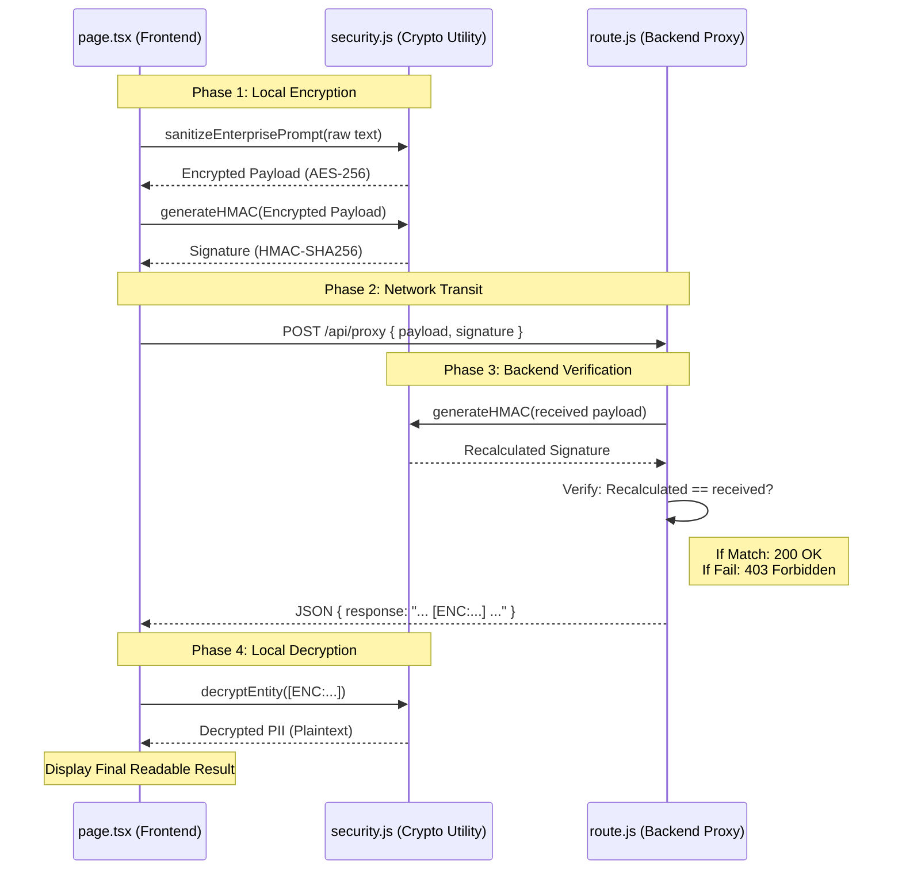

# CipherGate Application Workflow

Here is the complete workflow of the CipherGate application, breaking down the directory structure, how the components interact, and the step-by-step lifecycle of a single request.

## 📁 Directory Structure
Here is the layout of the critical files we created inside the `ciphergate/src` directory:

```text
ciphergate/src/
├── utils/
│   └── security.js        # The Cryptographic Engine (AES, HMAC, Regex)
└── app/
    ├── page.tsx           # The Frontend UI (React Client Component)
    └── api/
        └── proxy/
            └── route.js   # The Backend Server (Next.js API Route)
```

---

## 🔄 The End-to-End Workflow

When you type a message and click "Execute Secure Query", the application follows this exact sequence:

### Phase 1: Local Client Processing (Trusted Zone)
*File: `src/app/page.tsx` & `src/utils/security.js`*

1. **User Input:** You enter raw text in the `page.tsx` UI, e.g., *"Invoice for $500 sent to admin@corp.com"*.
2. **Sanitization & Encryption:** `page.tsx` calls `sanitizeEnterprisePrompt()` from `security.js`.
   - The function uses Regular Expressions to detect `$500` and `admin@corp.com`.
   - It passes those specific values to `encryptEntity()`.
   - `encryptEntity()` uses **AES-256** and the `CLIENT_ENCRYPTION_KEY` to convert them into ciphertext.
   - The resulting payload looks like: *"Invoice for `[ENC:U2Fs...]` sent to `[ENC:V3Fs...]`"*.
3. **Signature Generation:** Next, `page.tsx` calls `generateHMAC()` from `security.js`, passing the *encrypted* payload and hashing it with the `HMAC_SHARED_SECRET` to generate a unique cryptographic signature.

### Phase 2: Network Transmission (Untrusted Zone)
*File: `src/app/page.tsx`*

4. **Visual Intercept:** The `networkTraffic` state is updated, which makes the ciphertext and signature visually appear on the right side of your screen. 
5. **The POST Request:** The frontend fires a `fetch()` request to the backend proxy route (`/api/proxy`). It transmits a JSON body containing two things: `{ payload, signature }`.

### Phase 3: Backend Verification (The Untrusted Gateway)
*File: `src/app/api/proxy/route.js`*

6. **Receiving Data:** The server receives the POST request. 
7. **Integrity Check:** The backend *does not* trust the incoming signature. It takes the incoming `payload`, imports `generateHMAC()` from `security.js`, and recalculates the signature itself using the shared secret.
8. **Comparison:** 
   - If the recalculated signature **does not match** the incoming signature (meaning a Man-in-the-Middle altered the text), it rejects it with a `403 Forbidden` error.
   - If it **matches**, it knows the data is authentic and untouched.
9. **The Response:** Since the backend doesn't have the AES key, it cannot decrypt the PII. It simply wraps the encrypted payload in a mock "Enterprise AI" response string and sends it back to the client (`200 OK`).

### Phase 4: Local Decryption (Trusted Zone)
*File: `src/app/page.tsx` & `src/utils/security.js`*

10. **Receiving the Response:** `page.tsx` gets the response back from the server.
11. **Extraction & Decryption:** It runs a Regex to hunt for any blocks starting with `[ENC:... ]`. It passes those blocks to `decryptEntity()` in `security.js`.
12. **Final Display:** `decryptEntity()` decrypts the AES ciphertexts back into `$500` and `admin@corp.com`. The fully readable text is then rendered in the success box on the UI.

---

## 🗺️ Visual Architecture Diagram

Here is a visual map of how the data flows between these components:



This modular approach ensures that your cryptographic logic (`security.js`) is decoupled, meaning it can be shared by both the client (for encryption/decryption) and the server (for HMAC verification) while keeping the keys logically separated!
